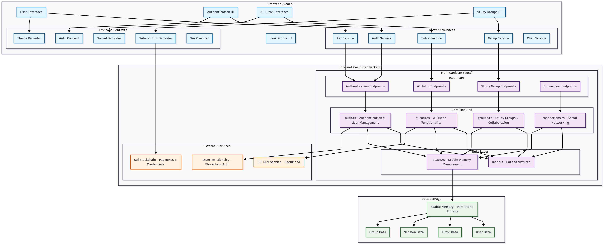

# CogniEdufy: Next-Generation Agentic AI Learning Platform

[](https://opensource.org/licenses/ISC)
[](https://nodejs.org/)
[](https://www.rust-lang.org/)
[]()

## 🎓 Overview

CogniEdufy is a revolutionary educational platform powered by **Agentic AI**. It moves beyond static learning management systems by employing autonomous AI agents that act as personalized tutors. These agents adapt in real-time to collaborative learning environments and individual student behaviors, creating a dynamic curriculum that evolves with every interaction.

### 🌟 Key Features

- **🤖 Agentic AI Tutors**: Autonomous AI agents that analyze learning patterns to provide hyper-personalized guidance and adaptive curriculum adjustments.
- **🎧 Multi-Modal Learning**: Seamless switching between text, interactive audio, and video (in progress) to match user learning styles.
- **🧠 Adaptive Knowledge Paths**: AI-driven curriculum that restructures itself based on student performance and engagement metrics.
- **👥 Intelligent Study Groups**: AI-moderated collaborative sessions that group students by compatible learning paces and complementary skill sets.
- **🏆 Smart Gamification**: Dynamic achievement system where milestones are personalized to encourage consistent progress.
- **📊 Predictive Analytics**: Deep insights into learning behaviors, predicting potential roadblocks before they occur.
- **🎨 Modern UI**: Beautiful, responsive interface with dark/light themes designed for cognitive ease.

## 🏗️ Architecture



### Backend (High-Performance Rust)
- **Core Logic**: Rust-based high-concurrency backend.
- **AI Engine**: Agentic AI system integrated with LLMs for context-aware tutoring.
- **Data Layer**: Optimized storage for complex user states and learning history.
- **Authentication**: Secure, multi-method authentication system.

### Frontend (React + TypeScript)
- **Framework**: React 18 with TypeScript.
- **Styling**: Tailwind CSS with custom components.
- **State Management**: React Context + TanStack Query.
- **Routing**: React Router v6.
- **Animations**: Framer Motion + GSAP.
- **Visualization**: Chart.js + Recharts for learning analytics.

## 🚀 Quick Start

### Prerequisites

- [Node.js](https://nodejs.org/) (v16 or higher)
- [Rust](https://www.rust-lang.org/tools/install) (for backend services)

### Installation

1. **Clone the repository**
   ```bash
   git clone <repository-url>
   cd cogni-edufy
   ```

2. **Install dependencies**
   ```bash
   # Install frontend dependencies
   cd src/cogni-icp-frontend
   npm install
   
   # Install backend dependencies
   cd ../../src/cogni-icp-backend
   cargo build
   ```

3. **Start the local Internet Computer replica**
   ```bash
   dfx start --background
   ```

4. **Deploy the canisters**
   ```bash
   dfx deploy
   ```

5. **Start the development server**
   ```bash
   cd src/cogni-icp-frontend
   npm start
   ```

The application will be available at:
- Frontend: `http://localhost:3000`
- Backend: `http://localhost:4943`

## 📁 Project Structure

```
cogni-edufy/
├── src/
│   ├── cogni-icp-backend/          # Rust backend canister
│   │   ├── src/
│   │   │   ├── models/            # Data models
│   │   │   │   ├── user.rs        # User management
│   │   │   │   ├── tutor.rs       # Agentic AI tutor system
│   │   │   │   ├── study_group/   # Collaborative learning
│   │   │   │   ├── gamification.rs # Achievement system
│   │   │   │   └── billing.rs     # Subscription management
│   │   │   ├── state.rs           # Canister state management
│   │   │   └── lib.rs             # Main canister logic
│   │   └── Cargo.toml
│   └── cogni-icp-frontend/        # React frontend
│       ├── src/
│       │   ├── components/        # Reusable UI components
│       │   │   ├── auth/          # Authentication components
│       │   │   ├── groups/        # Study group components
│       │   │   ├── tutors/        # AI tutor interface
│       │   │   ├── landing/       # Marketing pages
│       │   │   └── shared/        # Common components
│       │   ├── pages/             # Page components
│       │   ├── contexts/          # React contexts
│       │   ├── services/          # API services
│       │   └── hooks/             # Custom React hooks
│       └── package.json
├── dfx.json                        # DFX configuration
└── package.json                    # Root package.json
```

## 🎯 Core AI Capabilities

### Agentic AI-Powered Tutoring
- **Context Retention**: Agents remember previous sessions to build long-term learning strategies.
- **Socratic Method**: The AI is programmed to ask guiding questions rather than just providing answers, fostering critical thinking.
- **Real-time Adaptation**: Content difficulty adjusts instantly based on user response accuracy and latency.
- **Multi-Modal Interaction**: Users can speak to the AI and receive verbal responses, or switch to text for note-taking.

### Intelligent Collaboration
- **Smart Grouping**: Algorithms match learners with peers who have complementary knowledge gaps.
- **AI Moderation**: Automated agents facilitate group discussions to keep study sessions focused and productive.
- **Resource Synthesis**: The AI can summarize group discussions and generate shared study notes automatically.

## 🔧 Development

### Backend Development
The backend is built with Rust for safety and performance, specifically designed to handle the heavy computational load of real-time AI agents.

- **AI Pipeline**: Modular design allowing for easy swapping of LLM providers or internal models.
- **State Management**: Robust handling of concurrent user sessions and persistent agent memory.

### Frontend Development
The frontend focuses on a distraction-free learning environment:

- **Component Architecture**: Modular design for rapid feature iteration.
- **Performance**: Optimized rendering for real-time chat and data visualization.

## 🤝 Contributing
We welcome contributions! Please see our contributing guidelines:

1. Fork the repository
2. Create a feature branch
3. Make your changes
4. Add tests if applicable
5. Submit a pull request

## 📄 License
This project is licensed under the ISC License - see the [LICENSE](LICENSE) file for details.

## 🔗 Links
- [Rust Documentation](https://doc.rust-lang.org/)
- [React Documentation](https://reactjs.org/docs/)
- [OpenAI API Documentation](https://platform.openai.com/docs) (or relevant AI provider)

## 📞 Support
For support and questions:

- Create an issue in the repository
- Join our community discussions
- Contact the development team

---

**Empowering Education with Agentic AI**
**Built with ❤️ on the Internet Computer**
